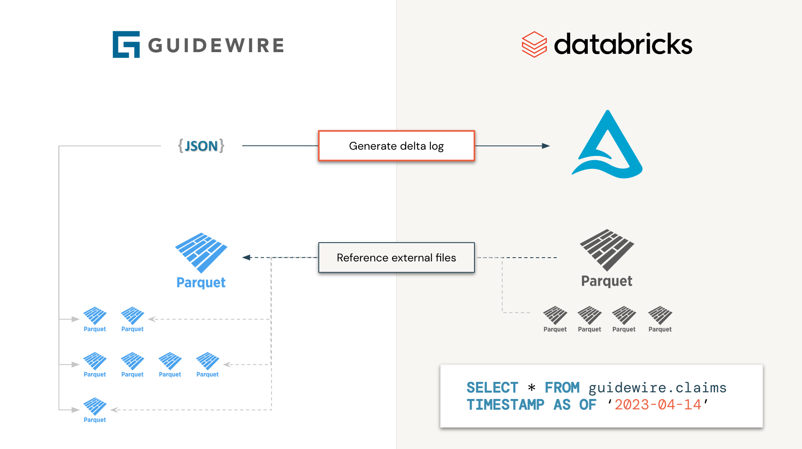
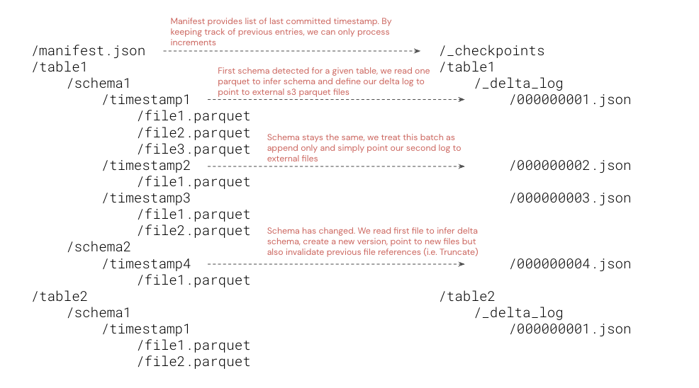

# Guidewire Arrow

This is a fork of:
https://github.com/databricks-industry-solutions/guidewire

I have rewritten this to work using pyarrow, ray and delta-rs so it can run on any python envioronment including Databricks Unity Catalog runtimes


[](https://docs.databricks.com/release-notes/runtime/12.2.html)
[](https://databricks.com/try-databricks)
[](https://databricks.com/try-databricks)


**Interpreting guidewire CDA as delta table:** 
*As a technology company, [Guidewire](https://www.guidewire.com/) offers an industry platform for property and casualty 
insurance carriers worldwide. Through different products and services under their insurance suite, they provide users
with the operation capabilities required to acquire, process and settle claims, maintains policies, support underwriting
and adjustment processes. Databricks on the other hand provides users with analytical capabilities (from basic 
reporting to complex ML solutions) through their
[lakehouse for Insurance](https://www.databricks.com/solutions/industries/financial-services). By combining both
platforms together, P&C insurance companies have now the ability to start integrating advanced analytics capabilities
(AI/ML) into their core business processes, enriching customer information with alternative data (e.g. weather data) 
but equally reconciling and reporting critical information at enterprise scale.*

___


## Approach

Guidewire supports data access to analytical environment via their Cloud Data Access offering 
([CDA](https://developer.guidewire.com/introducing-guidewire-data-platform/)). Storing files as individual parquet files
under different timestamps and schema evolution is unfortunately making processing difficult for end users. Instead
of processing files individually, why wouldn't we generate the `delta log` manifest files to only read information
we need, when we need it, without having to download, process and reconcile complex information? This is the principle
behind this initiative. The generated delta table will not be materialized (data will not be physically moving) but act
as a [shallow clone](https://docs.databricks.com/sql/language-manual/delta-clone.html) to guidewire data. 



More specifically, we will process all Guidewire tables independently, in parallel (i.e. as a spark job), where each
task will consist in only listing parquet files and folders and generating delta log accordingly. From an end user 
standpoint, guidewire will look as a Delta table and be processed as such, reducing processing time from days to seconds 
(since we do not have to download and process each file through many spark jobs).



As the data is now on Delta lake (physically materialized or not), one can benefit from all the downstream 
capabilities of delta lake, "subscribing" to changes via 
[auto-loader](https://docs.databricks.com/ingestion/auto-loader/index.html) capabilities, delta live table
([DLT](https://www.databricks.com/product/delta-live-tables)) or even 
[delta sharing](https://www.databricks.com/product/delta-sharing), accelerating time to insights from days to minutes.

## A word of caution

As this model follows a shallow clone approach, it is recommended to only grant read permission to end user since a 
`VACCUM` operation on the generated delta would possibly result in data loss on the guidewire S3 bucket. We highly
recommend organization not exposing this raw dataset to end users but rather create a SILVER version with materialized
data for consumption. Note that an `OPTIMIZE` command will result in materialization of latest delta snapshot with optimized
parquet files. Only the relevant files will be physically downloaded from original S3 to destination table.


## Features

- **Manifest Management**: Reads and filters manifest files stored in S3.
- **Batch Processing**: Processes data batches using PyArrow and Delta Lake.
- **Delta Lake Integration**: Maintains Delta Lake logs and checkpoints for data consistency.
- **Parallel Processing**: Utilizes Ray for distributed and parallelized data processing.

## Project Structure

```
guidewire-arrow/
├── guidewire/
│   ├── __init__.py
│   ├── manifest.py       # Handles manifest file operations
│   ├── batch.py          # Processes data batches
│   ├── delta_log.py      # Manages Delta Lake logs and checkpoints
│   ├── processor.py      # Orchestrates the data processing workflow
│   ├── storage.py        # Manages cloud storage operations (S3/Azure)
│   ├── results.py        # Tracks processing results and metrics
│   └── logging.py        # Logging configuration and utilities
├── main.py               # Entry point for the pipeline
├── requirements.txt      # Python dependencies
├── README.md             # Project documentation
```

## Installation

### Prerequisites

- Python 3.10 or higher
- AWS and Azure credentials with appropriate permissions
- `pip` for dependency management


1. Clone the repository:
```bash
git clone <repository-url>
cd guidwire-arrow
```
2. Create a virtual environment and activate it:
```bash
python3 -m venv venv
source venv/bin/activate
```
3. Install Dependencies

```bash
pip install -r requirements.txt
```
4. Set up environment variables in a .env file: 
``` 
AWS_SECRET_ACCESS_KEY = <your-aws-secret-access-key> 
AWS_ACCESS_KEY_ID = <your-aws-access-key-id>
AWS_REGION = <your-aws-region>
AWS_MANIFEST_LOCATION = <your-manifest-location>
AZURE_STORAGE_ACCOUNT_NAME = <your-azure-storage-account-name>
AZURE_STORAGE_ACCOUNT_CONTAINER_NAME = <your-azure-container-name>
AZURE_STORAGE_ACCOUNT_KEY = <your-azure-storage-account-key>
OR 
AZURE_TENANT_ID = <your-tenant-id>
AZURE_CLIENT_ID= <your-client-id>
AZURE_CLIENT_SECRET= <your-secret>
Optional
AZURE_STORAGE_SUBFOLDER = <azure-sub-folder>
AWS_ENDPOINT_URL = <aws-endpoint-overwrite>
RAY_DEDUP_LOGS = "0"
DELTA_LOG_CHECKPOINT_INTERVAL = "100" - interval to update the log
SHOW_TABLE_PROGRESS = "0" - disable the progress bars
```

## Key Components
### Manifest
The Manifest class in manifest.py reads and filters manifest files stored in S3. It initializes the manifest schema and provides methods to access specific entries.

### Batch
The Batch class in batch.py processes data batches. It handles schema discovery, processes data files, and interacts with Delta Lake logs.

### DeltaLog
The DeltaLog class in delta_log.py manages Delta Lake logs and checkpoints. It supports creating new Delta tables, adding transactions, and maintaining checkpoints.

### Processor
The Processor class in processor.py orchestrates the overall data processing workflow. It manages the parallel processing of data using Ray, coordinates between manifest reading, batch processing, and delta log management. The processor handles the end-to-end pipeline execution, ensuring efficient and reliable data processing across distributed systems.

### Storage
The Storage class in storage.py provides a unified interface for cloud storage operations across different providers (AWS S3 and Azure Blob Storage). It handles authentication, file operations, and storage-specific configurations, abstracting away the complexities of interacting with different cloud storage services. This component ensures consistent data access patterns regardless of the underlying storage platform.

### Results
The Results module in results.py provides comprehensive tracking and monitoring of processing operations. The `Result` dataclass captures detailed metrics including:

- **Processing Timing**: Start and finish timestamps for each table processing operation
- **Watermark Management**: Tracks data watermarks and schema timestamps throughout processing
- **Version Control**: Records Delta Lake versions before and after processing
- **Manifest Metrics**: Captures record counts and manifest watermarks
- **Error Handling**: Collects and stores errors and warnings that occur during processing
- **Progress Tracking**: Maintains lists of processed watermarks and schema changes

This module enables comprehensive monitoring, debugging, and audit trails for data processing workflows, ensuring transparency and reliability in large-scale data operations.

### Progress UI
The system features an intelligent progress tracking interface that adapts to the execution environment:

- **Adaptive Progress Bars**: Automatically detects whether Ray is initialized for distributed processing
- **Ray Integration**: Uses `ray.experimental.tqdm_ray.tqdm` for proper progress display in distributed environments
- **Fallback Support**: Falls back to standard `tqdm` for single-threaded or non-Ray environments
- **Real-time Updates**: Provides live progress feedback during batch processing operations
- **Error Integration**: Progress bars are integrated with the results tracking system for comprehensive monitoring

The progress UI ensures users have clear visibility into processing status regardless of whether they're running single-threaded or distributed workloads.

## Dependencies

The project requires the following core dependencies:

- **Ray (v2.45.0)**: For distributed and parallel processing
- **DeltaLake (v1.1.4)**: For managing Delta Lake logs and operations
- **PyArrow (v20.0.0)**: For efficient data processing and columnar operations
- **tqdm (v4.67.0)**: For progress bars and monitoring
- **pytest (v8.3.5)**: For testing framework
- **setuptools (v80.9.0)**: For package building and distribution

### Version Information
- **Package Version**: 0.0.2

## Examples

### Single-threaded Processing
```python
from guidewire.processor import Processor

# Create processor instance with single-threaded mode
processor = Processor(
    parallel=False
    table_names=["table1","table2"]
)
# Run the processing
processor.run()

```

### Parallel Processing
```python
from guidewire.processor import Processor

# Create processor instance with parallel processing (default) of all tables in the manifest
processor = Processor(
    parallel=True,  # This is the default setting
)

# Run the processing
processor.run()

# Access processing results
for result in processor.results:
    print(f"Table: {result.table}")
    print(f"Processing time: {result.process_finish_time - result.process_start_time}")
    print(f"Records from manifest: {result.manifest_records}")
    print(f"Watermarks: {result.watermarks}")
    if result.errors:
        print(f"Errors encountered: {result.errors}")
    if result.warnings:
        print(f"Warnings: {result.warnings}")
```

### Working with Results
```python
from guidewire.processor import Processor
from guidewire.results import Result

# Process specific tables and capture detailed results
processor = Processor(
    table_names=("table1", "table2"),
    parallel=False
)
processor.run()

# Analyze results for monitoring and debugging
for result in processor.results:
    if result.errors:
        print(f"❌ {result.table}: Failed with errors - {result.errors}")
    elif result.warnings:
        print(f"⚠️  {result.table}: Completed with warnings - {result.warnings}")
    else:
        print(f"✅ {result.table}: Successfully processed {result.manifest_records} records")
        print(f"   - Version: {result.process_start_version} → {result.process_finish_version}")
        print(f"   - Watermark: {result.process_start_watermark} → {result.process_finish_watermark}")
```

## Contributing
Contributions are welcome! Please fork the repository and submit a pull request with your changes.